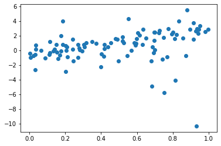
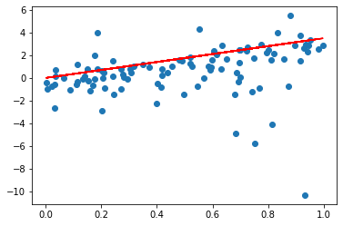

<!-- next year: do the intercept instead? Have students discover that the median minimizes MAE? It's confusing that we have a *slope* and a *gradient*. At the very least I should use the term *parameter*. 

Also, we could motivate more here about why we're doing this.

-->

## Outcomes

We're going to be working towards building up **our own neural net model from the ground up**. Here's the outline:

1. Single linear regression **this activity**
2. Multiple linear regression
3. Logistic regression
4. Multiple layers

The process of completing this assignment will improve your ability to:

- Describe the parameters and operation of a linear layer.
- Identify the following loss functions: Mean Squared Error and Mean Absolute Difference.
- Compute the gradients of programs with respect to parameters using one level of backpropagation

## Setup

Download the template: [`lab04.ipynb`](lab04.ipynb).


```python
import torch
from torch import tensor
import ipywidgets as widgets
import matplotlib.pyplot as plt
%matplotlib inline
```

## Task

Suppose we have a dataset with just a single feature `x` and continuous outcome variable `y`.

In general we're going to be faced with a dataset with an unknown and probably nonlinear relationship. But for now let's use a simple dataset with a known linear relationship:

```python
true_weights = 4.0
true_bias = -1.0

# Make the randomness consistent
torch.manual_seed(0)
# Use random x values
x = torch.rand(100)
# Generate random noise, same shape as *x*, that has some outliers.
noise = torch.distributions.studentT.StudentT(2.0).sample(x.shape)
# For a simpler variant, use  torch.randn_like(x).
#print(f"Noise mean: {noise.mean()}, noise variance {noise.var()}")
# Generate true y values 
y_true = true_weights * x + noise + true_bias
# Make a scatterplot. The semicolon at the end says to ignore the return value.
plt.scatter(x, y_true);
```

    

    


Let's fit a line to that!

In linear regression, we predict an output by computing `y_pred = weights * x + bias`.

This is a one-dimensional problem (each data point has only a single number, *x*), but the intuition we gain here will help us with multiple regression.

In fact, to keep things simple, we're going to start with **bias == 0**: we're only going to fit a slope.

Let's start with an arbitrary value for `weights` and see how it does.


```python
slope = 3.5
bias = 0.0
y_pred = weights * x + bias
plt.scatter(x, y_true); plt.plot(x, y_pred, 'r');
```


    

    


Hm, we're close but not great. The line is *too high*, but we're sticking with a *0 bias* so we can't just shift it down. What change could we make to the slope to get it better?

Find and run the code block corresponding the code below. **Adjust the slope slider until the line looks like it's fitting the data better.**


```python
@widgets.interact(slope=(-5.0, 5.0))
def plot_linreg(slope):
    y_pred = slope * x + bias
    plt.scatter(x, y_true)
    plt.plot(x, y_pred, 'r')
    resid = 0.0 # TODO
    mse = 0.0 # TODO
    mae = 0.0 # TODO
    print(f"MSE: {mse}, MAE: {mae}")
```

> Sidebar on implementation details:
>
> 1. The `@` line before a function is a *decorator*. They're really useful Python tricks. We're not studying them in class but I'd be happy to discuss at office hours.
> 2. `widgets.interact()` makes a slider widget and reruns the function when the slider changes. The `(-5.0, 5.0)` sets the *range* of the slider. Don't worry, `slope` is just a normal `float`.
> 3. The `f"MSE: {mse}"` is an `f`-string. Expressions in `{}` get evaluated. You can format them too: `f"MSE: {mse:0.3f}"`.

### Loss Functions

Did you get the best value for the slope? What about those outlier points?

Hopefully this has convinced you that it would be a good idea to *quantify* the error. And maybe even that there might be multiple ways to quantify the error, based on whether we care about those outliers or not.

We'll introduce two **loss functions**:

- Mean Squared Error (abbreviated **MSE**, also known as the *L2 norm*): square the residual, take the mean.
  - Technically, L2 norm is the *RMSE*, the square **R**oot of the MSE. But you might try to convince yourself that any parameter that minimizes the MSE also minimizes the RMSE and vice versa.
- Mean Absolute Error (abbreviated **MAE**, also known as the *L1 norm* or sometimes *mean absolute deviation*, MAD): flip negative errors to be positive (absolute value), take the mean.

Which one of them is more *sensitive* to outliers? Let's find out.

{}

1. Add correct computations of the `mse` and `mae` to the interactive function above. See your solution at the end of Lab 1 if you don't remember.
2. Adjust the slider to minimize MSE. Then adjust it to minimize MAE. Write down the values in the blank cell provided.
3. How would you describe the difference between the line that minimizes MSE and the line that minimizes MAE? Write your response in the cell provided.

{}

### Gradient

As you were tweaking the slope, you were effectively estimating the *gradient* of the loss function with respect to the parameter. The *gradient* tells us which direction (and how much) to change a value like *slope* if we want to *increase* a number like the MSE. Basically, how much does MSE change when we change that parameter?

Soon see how we can compute the gradient exactly using code. But for now, let's estimate that gradient *numerically*.

{}

1. Write a function `linreg_mse` that computes the MSE for a given slope. (Start with the function above, remove the plotting and `@interact`, add a `return`.) Test that function at a few specific values of `slope`.
2. We can compute the gradient using a numerical difference: `(linreg_mse(x0 + eps) - linreg_mse(x0)) / eps`. Set `eps` ("epsilon") to 1e-3 and use two different values of `x0`: 0.0, and the value that you wrote down above that minimizes the MSE.

<!--TODO: We need to explain this numerical difference! -->

{}

Write a brief description of how the numerical gradient behaves.

### Gradient Descent

Now that we know the gradient, we can use it to change the slope. Let's try **gradient ascent**:

{}

1. Set `slope = 0.0` and look at what the loss is using `linreg_mse`.
2. Take a small step in the direction of the gradient: `slope += 0.01 * gradient`.
3. Evaluate the loss again. How did it change?

{}

The gradient tells us how much the loss will *increase* as slope increases. But we want the loss to *decrease*. So we actually need to step in the *opposite* direction of the gradient. Hence the name *gradient descent*:

{}

1. Set `slope = 0.0` and look at what the loss is using `linreg_mse`.
2. Take a small step in the *descent direction*, the opposite direction of the gradient: `slope -= 0.01 * gradient`.
3. Evaluate the loss again. How did it change?

{}

The constant multiple 0.1 is called the *learning rate*. We'll worry about tuning it later; for now 0.01 is fine.

### Gradient Descent Loop (*optional*)

What happens if we repeatedly take steps in the descent direction? Let's try it!

{}

- Set `slope` to 0.0 and `losses` to an empty list (`[]`).
- Repeat 100 times:
  - Compute the loss (MSE) and append it to `losses`.
  - Compute the gradient (numerically, as before).
  - Step in the direction opposite the gradient, with a learning rate of 0.01.
- Plot `losses`: `plt.plot(losses)`

{}

## Check for Understanding

You should now be able to answer the following questions:

1. Considering the gradient of the slope parameter with respect to the MSE: if the value of the gradient is *positive*, which direction do we need to move to get a lower MSE?
2. If the value of the gradient is *negative*, which direction do we need to move to get a lower MSE?
3. What can we say about the gradient when the parameter minimizes the MSE?
4. What would we need to change in order to use gradient descent to minimize the MAE instead?
